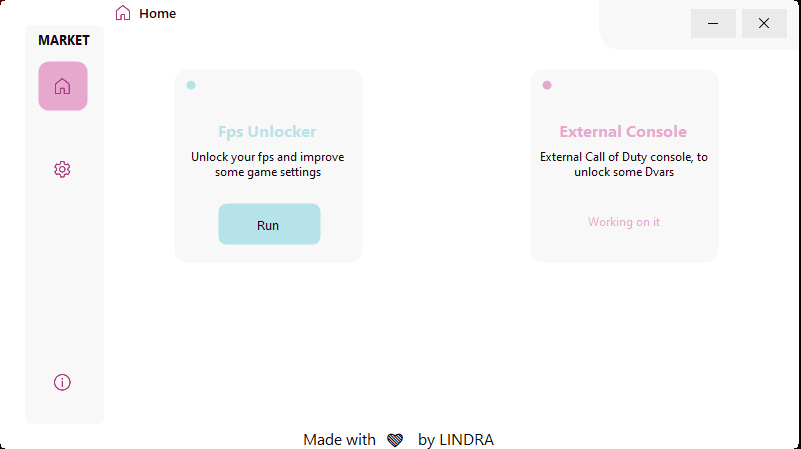
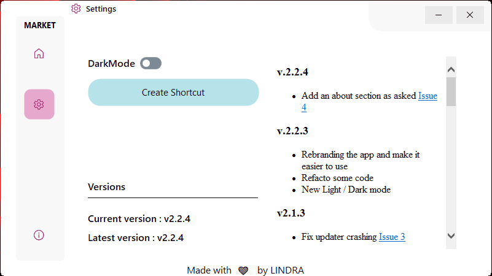
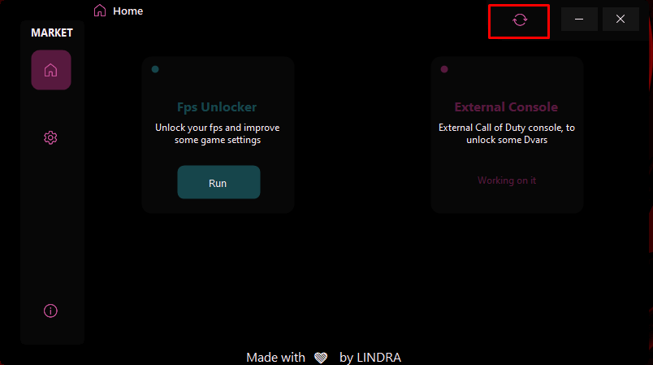
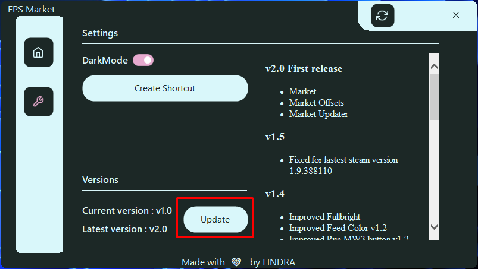

Market images

# Market (latest update 11/10/2024)
Call of Duty Market, is the latest version of my FPS Unlocker, if you want to learn a bit more about this **Market** tool, I will let you take a look at another GitHub repo called *CODEx*.

# Table of contents
- Installation guide
- Any suggestions ?
- Creator
- [History](https://github.com/PierroD/Market/blob/main/_readmes/History.md)
- [F.A.Q](https://github.com/PierroD/Market/blob/main/_readmes/FAQ.md)

# Installation guide

- [Download the lastest version](https://raw.githubusercontent.com/PierroD/Market/main/_updates/Market%20v2.4.9.zip) - (check if some updates are needed)
- Unzip the archive somehere on your computer
- Start `LINDRA - Market.exe`
- Enjoy :smiley:

If an update is needed you will see the following buttons :

# Any suggestions ?

If you want to submit a new idea or you faced a bug :bug:, feel free to create a new issue by clicking on the `Issues` tab in the github repo.

# Creator :
Dev & Designer :
 - Pierre DUVEAU aka LINDRA

