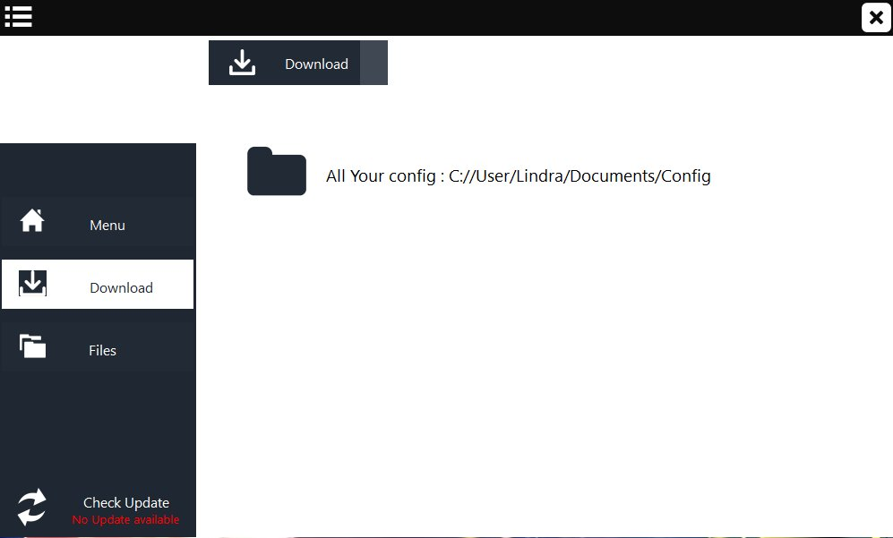
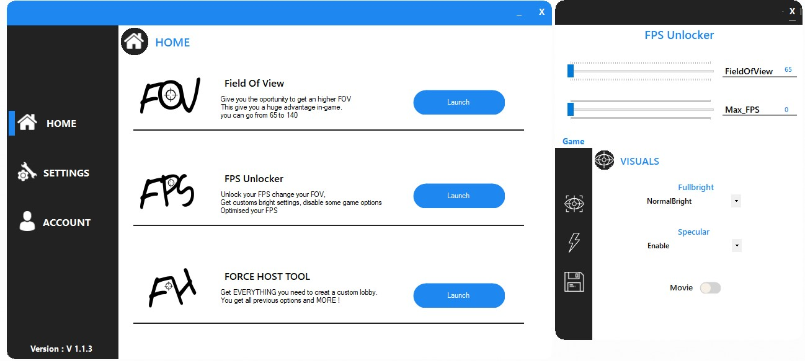
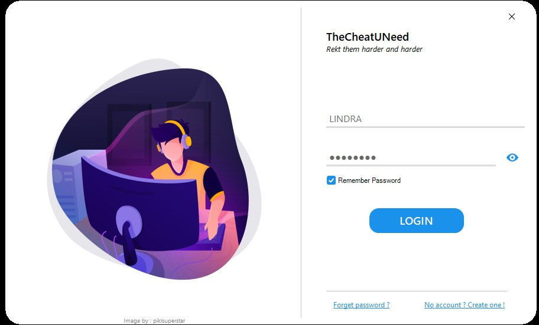
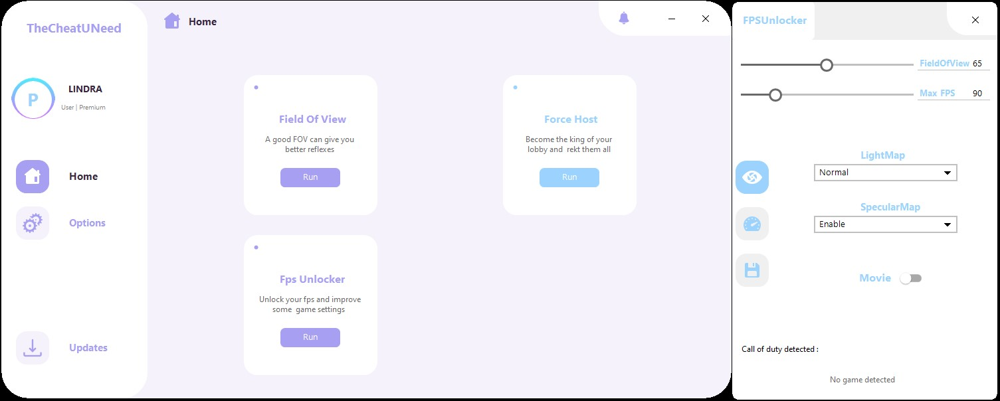
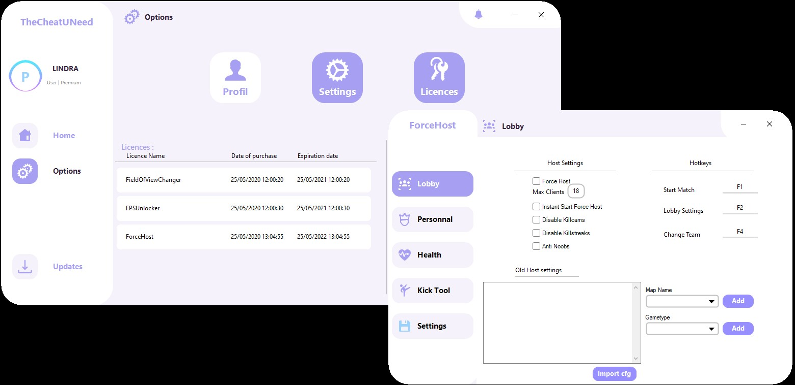

## Market history

## Introduction
First of all, you need to know that Market wasn't the original project at all :sweat_smile:
I wanted to create something bigger called **TCUN** (**T**he **C**heat **U** **N**eed), this project was suppose to let you use : 
- A FieldOfView changer
- A FPSUnlocker
- A Force Host

I spend 2 years designing & coding TCUN because I really wanted something beautifull and usefull at the same time, I actually create 3 versions of TCUN 

#### TCUN v1 (2018)

#### TCUN v2 (2019)

#### TCUN v3 (april 2020)

- The v1 and v2 were three quarters finished (Menu, FOVChanger, FPSUnlocker, Loading settings, "update downloader")
- The v3 was fully finished & functionnal, with a login/register method. I also added licences key, and presents key (people will be able to join the beta version)  I also had created an updater which was closed to Market updater but I decided not to release this tool because I didn't want to pay a domain name for a website and an API that 2 budy will use.

- Then I created [CODEx](https://github.com/PierroD/CODEx) which is an external Call of Duty console, and finally here we are.